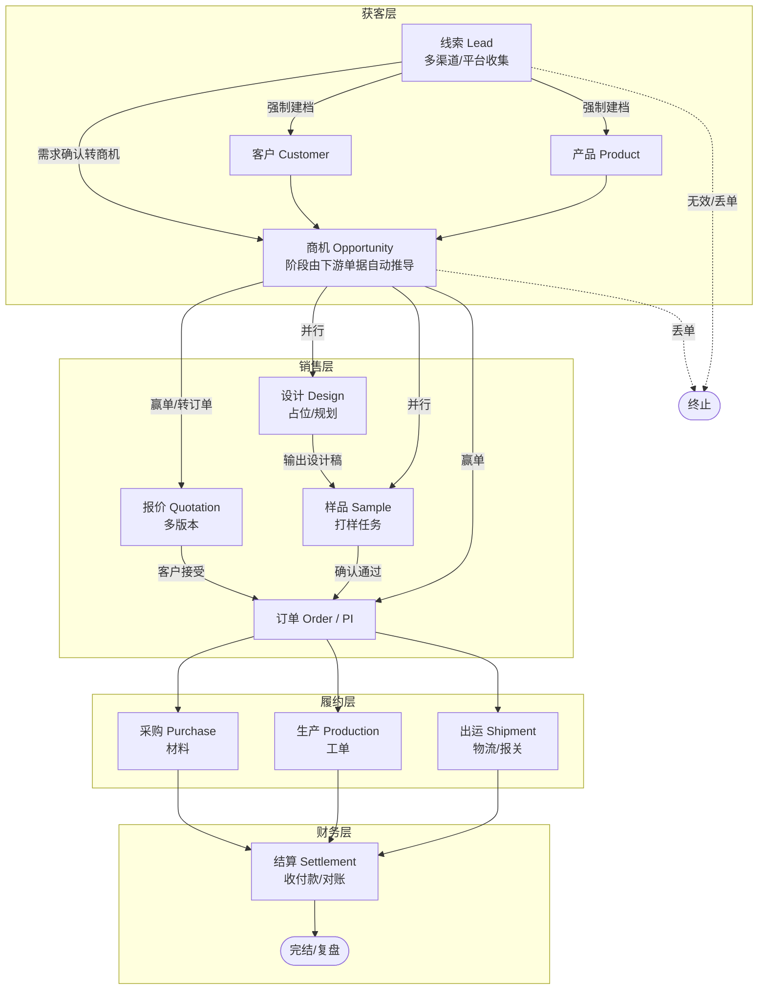
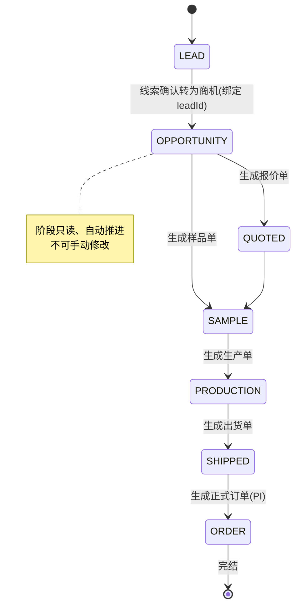
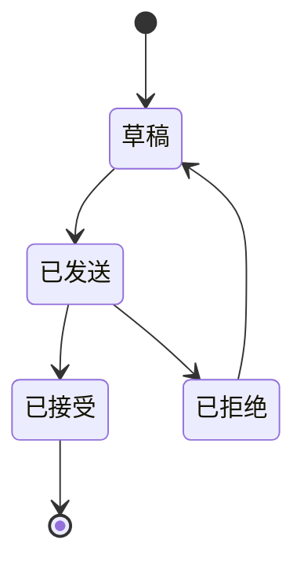
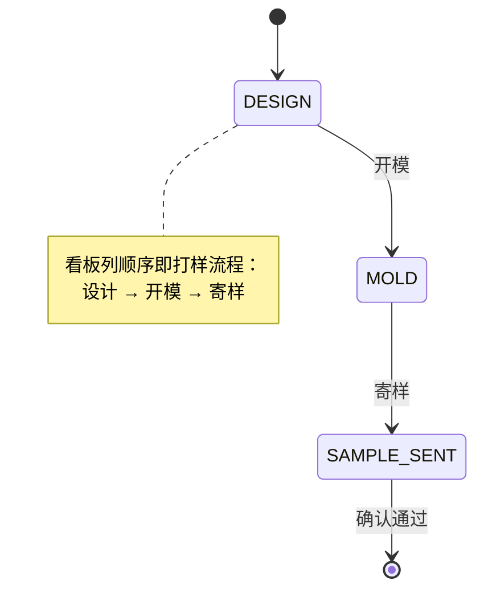
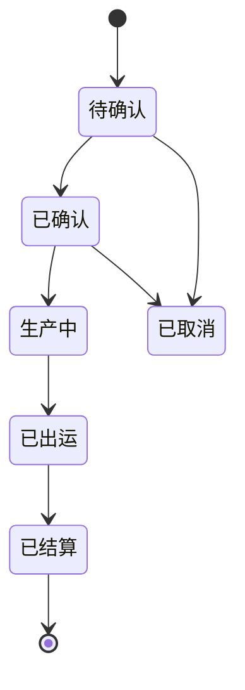
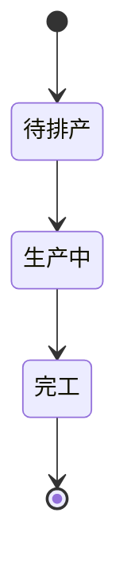
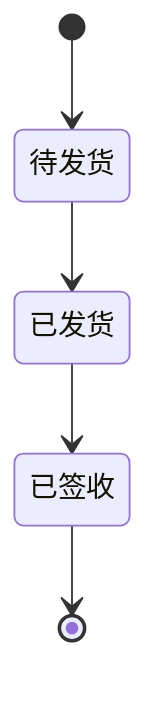
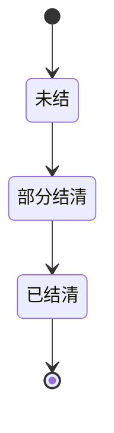

# 业务-生产 工贸一体型企业 全流程管理系统

> 范围：线索 → 客户 → 产品 → 商机 → 报价 → 设计 → 样品 → 订单 → 采购 → 生产 → 出运 → 结算
> 核心原则：客户/产品是主数据（全局唯一），商机/订单/下游都以"上游 ID"做硬关联，全链路可追溯。
> 最后更新：2026-08-28（对齐当前实现进度）

---

## 一、整体业务流程图（端到端）

**关键串联规则（上游 ID 硬关联）：**
- 商机 `.customerId` / `.productId` / `.leadId`
- 报价 `.opportunityId`
- 样品 `.opportunityId` + `.productId`
- 订单 `.opportunityId`（赢单后由商机生成）
- 采购 / 生产 / 出运 `.orderId`
- 结算 `.orderId` 或 `.shipmentId`

---

## 二、主对象生命周期状态机

### 2.1 商机 Opportunity（阶段派生，不落库）

> 阶段不再由前端手动维护，统一由关联的报价/订单单据推导（见 `server/src/utils/pipelineStage.ts`）。
> 优先级由后往前：越靠后代表推进得越远。

| 阶段 key | 含义 | 触发条件 |
|----------|------|----------|
| `LEAD` | 仅线索 | 尚未转为商机 |
| `OPPORTUNITY` | 商机 | 已绑定 leadId / 已建档 |
| `QUOTED` | 已报价 | 关联 ≥1 报价单 |
| `SAMPLE` | 已打样 | 关联 ≥1 样品单 |
| `PRODUCTION` | 已生产 | 关联 ≥1 生产单 |
| `SHIPPED` | 已出运 | 关联 ≥1 出货单 |
| `ORDER` | 已下单 | 关联 ≥1 正式订单 |

> 同一商机若关联多种单据，取最高阶（数值最大）阶段展示。

### 2.2 报价 Quotation

### 2.3 样品 Sample（报价/打样已并入统一订单 Order，type=SAMPLE）

| 阶段 key | 中文 | 说明 |
|----------|------|------|
| `DESIGN` | 设计 | 设计稿输出 |
| `MOLD` | 开模 | 开模打样 |
| `SAMPLE_SENT` | 寄样 | 寄出样品待确认 |

### 2.4 订单 Order / PI

### 2.5 生产 Production

### 2.6 出运 Shipment

### 2.7 结算 Settlement

---

## 三、分层与对象清单（对齐当前进度）

| 层 | 对象 | 说明 | 当前进度 |
|----|------|------|----------|
| 获客层 | 线索 Lead | 渠道来源、需求原始记录 | ✅ 已实现 |
| 主数据 | 客户 Customer | 往来方主数据 | ✅ 已实现 |
| 主数据 | 产品 Product | 货品库（工艺/受众/分类） | ✅ 已实现 |
| 销售层 | 商机 Opportunity | 阶段由下游自动推导（LEAD→ORDER） | ✅ 已实现 |
| 销售层 | 报价 Quotation | 多版本报价单（type=QUOTE） | ✅ 已实现 |
| 销售层 | 设计 Design | 设计规划占位 | 🟡 占位页 |
| 销售层 | 样品 Sample | 打样任务（type=SAMPLE，设计→开模→寄样） | ✅ 已实现 |
| 履约层 | 订单 Order | 履约起点（type=ORDER） | ✅ 已实现 |
| 履约层 | 采购 Purchase | 材料采购 | ✅ 已实现 |
| 履约层 | 生产 Production | 工单/进度 | 🟡 占位页 |
| 履约层 | 出运 Shipment | 物流/报关 | 🟡 占位页 |
| 财务层 | 结算 Settlement | 收付款/对账 | ✅ 已实现 |

> 图例：✅ 已实现 / 🟡 占位页（仅有壳，待做实）

---

## 四、建议落地顺序（按当前进度）

1. ✅ 商机做实：阶段由报价/样品/订单自动推导，只读不可手改
2. ✅ 报价模块：表单 + 列表，挂 `opportunityId`，支持多版本
3. ✅ 样品模块：任务卡片，挂 `opportunityId` + `productId`，阶段 设计→开模→寄样
4. ✅ 订单模块：由"赢单商机"生成，锁定金额/交期
5. 🟡 设计模块：当前为占位空状态，待补充设计稿/版本管理
6. 🟡 生产 / 出运：当前为占位空状态，以订单为驱动源扩展
7. ✅ 采购 / 结算：已实现，复用订单主数据

> 每一层复用已有 Customer / Product / Opportunity 主数据，不新建客户/产品表。
