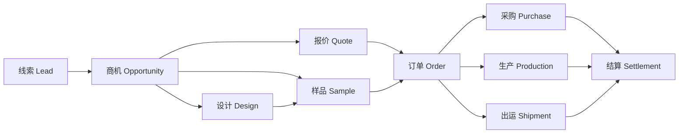
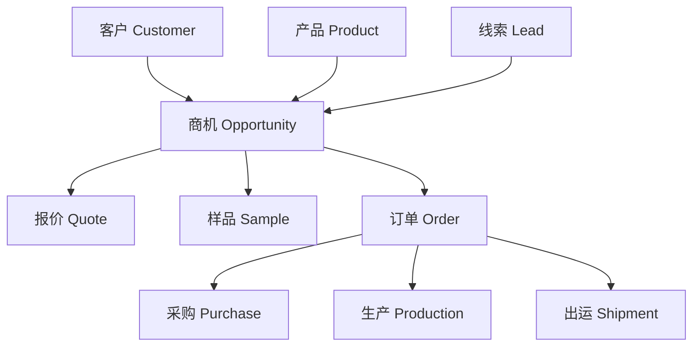
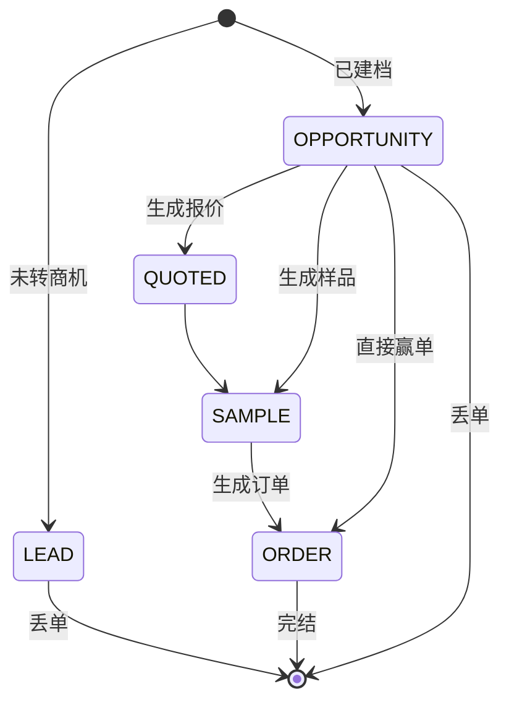
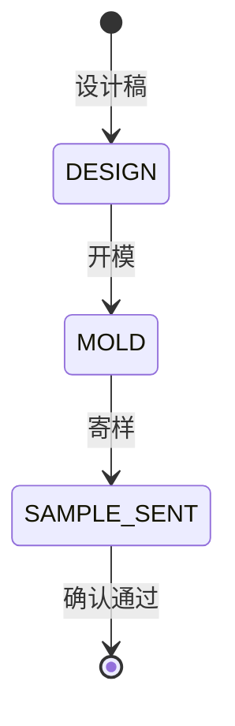
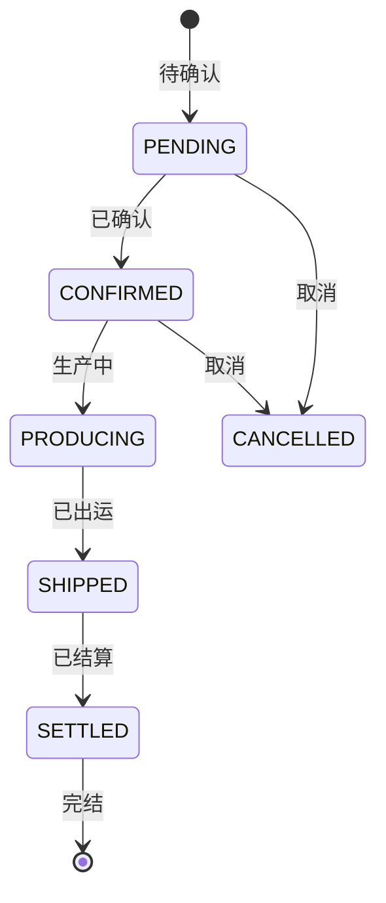
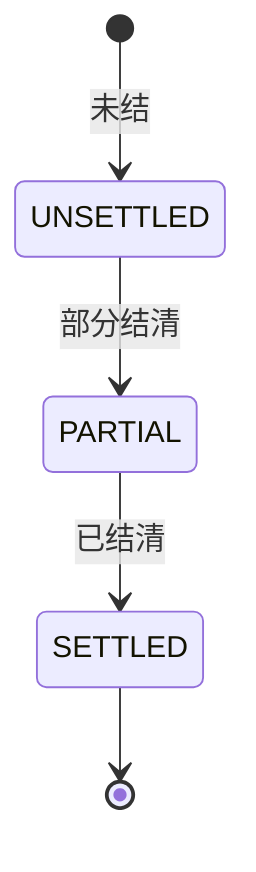

# 业务-生产 工贸一体型企业 全流程管理系统

> 范围：线索 → 客户 → 产品 → 商机 → 报价 → 设计 → 样品 → 订单 → 采购 → 生产 → 出运 → 结算
> 核心原则：客户/产品是主数据（全局唯一），商机/订单/下游都以"上游 ID"做硬关联，全链路可追溯。
> 最后更新：2026-08-28

---

## 一、整体业务流程

### 1.1 主线流程

### 1.2 主数据关系

### 1.3 关键串联规则

| 下游对象 | 必须关联的上游 ID |
|----------|------------------|
| 商机 | `leadId` / `customerId` / `productId` |
| 报价 | `opportunityId` |
| 样品 | `opportunityId` + `productId` |
| 订单 | `opportunityId` |
| 采购 / 生产 / 出运 | `orderId` |
| 结算 | `orderId` 或 `shipmentId` |

---

## 二、状态机

### 2.1 商机阶段（派生，只读）

商机阶段**不落库**，由关联的报价 / 样品 / 订单自动推导，优先级取最高阶段。

| 阶段 | 含义 | 触发条件 |
|------|------|----------|
| `LEAD` | 仅线索 | 尚未转为商机 |
| `OPPORTUNITY` | 已建档 | 已关联线索 / 客户 / 产品 |
| `QUOTED` | 已报价 | 关联 ≥1 报价单 |
| `SAMPLE` | 已打样 | 关联 ≥1 样品单 |
| `ORDER` | 已下单 | 关联 ≥1 正式订单 |

> 同一商机同时存在报价 + 样品 + 订单时，展示最高阶段 `ORDER`。

### 2.2 样品阶段

### 2.3 订单阶段

### 2.4 结算阶段

---

## 三、各流程涉及字段（数据模型）

> 字段取自 `prisma/schema.prisma`，按业务对象分组罗列。带 `?` 为可空字段。

### 3.1 线索 Lead

| 字段 | 类型 | 说明 |
|------|------|------|
| `id` | String (uuid) | 主键 |
| `leadNumber` | String? | 线索号：XS-YYYYMM-序号 |
| `leadName` | String | 线索名称（标题，规则：国家+产品+数量） |
| `customerId` | String? | 关联客户（转客户后回填） |
| `pipelineId` | String? @unique | 关联商机（确认转商机后回填） |
| `channelId` / `shopId` | String? | 来源渠道 / 来源平台 |
| `source` | String | MANUAL / EXCEL / RPA / SYNC |
| `status` | String | NEW / CONTACTED / QUALIFIED / INVALID / CONVERTED / VALID |
| `companyName` / `contactName` / `contactMethod` | String? | 客户信息（未关联客户时直填） |
| `email` / `phone` / `country` | String? | 联系方式 / 国家 |
| `productInterest` / `productName` / `productId` | String? | 感兴趣产品 / 待建档产品名 / 关联产品 |
| `quantity` | Int | 采购数量 |
| `sourceChannel` | String? | 来源渠道/平台完整路径 |
| `remark` | String? | 备注 |
| 详情扩展 | — | `targetMarket`(目标市场) / `productType`(产品类型) / `productDesc`(产品描述) / `images`(参考图 JSON) / `targetPrice`(目标价位) / `certRequire`(认证要求) / `packageReq`(包装要求) / `deliveryReq`(交期要求) / `specialReq`(特殊要求) / `customerType`(客户类型) |
| `assignedTo` | String? | 负责人 userId（null = 公海） |
| `createdBy` / `createdAt` / `updatedAt` | String / DateTime | 审计字段 |

### 3.2 客户 Customer

| 字段 | 类型 | 说明 |
|------|------|------|
| `id` | String (uuid) | 主键 |
| `customerCode` | String? @unique | 客户编号：CUS-YYMMDD-序号 |
| `companyName` | String | 公司名 |
| `contactName` / `englishName` / `position` | String? | 联系人 / 英文名 / 职位 |
| `email` / `phone` / `wechat` | String? | 联系方式 |
| `country` / `region` | String? | 国家 / 地区（省·市） |
| `customerLevel` | String? | 钻石/战略/优质/普通/潜在客户 |
| `source` | String? | MANUAL / EXCEL / XIAOMAN |
| `ownerId` | String? | 归属人（null = 公海） |
| `isKeyAccount` | Boolean | 重点客户标记 |
| `intentLevel` | String? | LOW / MEDIUM / HIGH / READY |
| `tags` | String? | 客户标签（逗号分隔） |
| `firstOrderDate` | String? | 首次下单日期（自动推算） |
| `estimatedAmount` | Float? | 预计商机金额 |
| `customerType` | String? | 客户类型（与 CustomerType 一致） |
| `notes` | String? | 备注 |

### 3.3 产品 SingleProduct

| 字段 | 类型 | 说明 |
|------|------|------|
| `id` / `name` / `sku` | String | 主键 / 名称 / SKU |
| 三级分类 | — | `crafts`(多对多工艺) / `audienceId`(二级受众) / `categoryId`(三级品类) |
| 产品属性 | — | `images`(图片 JSON) / `sizeL` `sizeW` `sizeH`(尺寸 cm) / `weight`(克重 g) |
| 产品要求 | — | `sampleNo`(打样单号) / `logo` `sound` `glow` `colorChange` `sprayWater`(功能布尔) / `colors`(潘通色) / `packaging`(包装) |
| `supplyModes` | String? | 供货定制模式：DEEP_CUSTOM / LIGHT_CUSTOM / STOCK（逗号分隔） |
| `certificationIds` | String? | 关联证书 id（逗号分隔） |
| `progress` | String? | 产品进度(JSON，打样/报价多子任务并行) |
| 价格库存 | — | `price`(单价) / `currency` / `taxRate`(税率) / `stock`(库存) / `lowStockAlert`(低库存预警) |
| `visibility` | String | PUBLIC（全员可见）/ PRIVATE（指定用户可见） |
| `source` / `description` / `remark` | — | 来源 / 描述 / 备注 |
| `createdBy` / `ownerId` | String? | 创建人 / 负责人（转交线索时联动） |
| `visibleUsers` | 关联 | visibility=PRIVATE 时可见用户列表 |

> 组合产品 `ComboProduct`：由多个 `SingleProduct`（`ComboItem`）构成，含 `name` / `sku` / `ownerId` / `status` / `remark`。

### 3.4 商机 SalesPipeline

> 阶段字段已删除，由关联单据推导（见 `server/src/utils/pipelineStage.ts`），不落库。

| 字段 | 类型 | 说明 |
|------|------|------|
| `id` / `pipelineNumber` | String | 主键 / 商机编号：BO-YYYYMMDD-序号 |
| `customerId` / `leadId` | String? | 关联客户 / 来源线索（溯源） |
| 基础信息 | — | `title`(标题) / `companyName` / `contactName` / `email` / `phone` / `country` |
| 线索阶段 | — | `source`(XIAOMAN/EXCEL/MANUAL) / `productInterest` / `leadNotes` |
| 商机阶段 | — | `estimatedAmount`(预估金额) / `estimatedCloseDate`(预计成交日) / `probability`(采购意向文案) / `opportunityNotes` |
| 订单阶段 | — | `orderAmount` / `orderDate` / `deliveryDate` / `paymentTerms` / `orderStatus` / `orderNotes` |
| 样品阶段 | — | `sampleType` / `sampleStatus` / `sampleQuantity` / `sampleNotes`（导入兼容） |
| `assignedTo` | String? | 负责人 userId |

### 3.5 报价 Quotation

| 字段 | 类型 | 说明 |
|------|------|------|
| `id` | String | 主键 |
| `opportunityId` | String | 关联商机（SalesPipeline.id） |
| `customerId` / `productId` | String? | 关联客户 / 产品 |
| `title` | String | 报价标题 |
| `version` | Int | 版本号（同一商机可多版） |
| `amount` / `currency` | Float / String | 报价金额 / 币种（默认 USD） |
| `validUntil` | DateTime? | 报价有效期 |
| `status` | String | DRAFT / SENT / ACCEPTED / REJECTED |
| `notes` | String? | 备注 |

### 3.6 通用单据 Order（报价 / 样品 / 订单 / 生产 / 出运）

> `type` 区分：`QUOTE`(报价) / `SAMPLE`(样品) / `ORDER`(订单) / `PRODUCTION`(生产) / `SHIPPED`(出运)

| 字段 | 类型 | 说明 |
|------|------|------|
| `id` / `orderNo` / `title` | String? | 主键 / 单据号 / 标题 |
| `type` | String | QUOTE / SAMPLE / ORDER / PRODUCTION / SHIPPED |
| `customerId` | String | 关联客户 |
| `targetType` / `targetId` | String? | 来源：PRODUCT / GROUP |
| `pipelineId` | String? | 绑定商机 ID |
| `status` | String | DRAFT / SUBMITTED / APPROVED / REJECTED（审批态） |
| `stage` | String? | 仅 SAMPLE：`DESIGN` → `MOLD` → `SAMPLE_SENT` |
| `items` | String? | 明细 JSON：{productId,name,spec,quantity,unitPrice,amount,pipelineId?} |
| `amountCNY` / `currency` | Float? / String? | 金额合计 / 币种（默认 CNY） |
| 订单专属 | — | `orderDate` / `depositAmount`(定金) / `depositPaid` / `deliveryDate` / `paymentTerms` |
| 时间节点 | — | `sampleOrderDate` / `designDate` / `moldDate` / `sampleSentDate` / `productionStartDate` / `shippedDate` |
| `remark` / `createdBy` | String? | 备注 / 创建人 |

### 3.7 采购 PurchaseOrder

| 字段 | 类型 | 说明 |
|------|------|------|
| `id` / `purchaseNo` | String | 主键 / 采购单号 PO-xxxx（@unique） |
| `supplierId` | String? | 关联供应商 |
| `purchaseDate` | String? | 采购日期 |
| `status` | String | DRAFT / ORDERED / PARTIAL / ARRIVED / CANCELLED |
| `items` | String? | 明细 JSON：{productId,name,spec,quantity,unitPrice,amount} |
| `amountCNY` | Float? | 明细合计 |
| `ownerId` | String? | 负责人（采购员，数据范围归属） |
| `remark` / `createdBy` | String? | 备注 / 创建人 |

### 3.8 出运 / 生产 / 结算

| 对象 | 主要字段 |
|------|----------|
| 出运 Shipment | 复用 `Order(type=SHIPPED)`：`status` 推进到 SHIPPED、`shippedDate`(出运日期)、`items` 明细 |
| 生产 Production | 复用 `Order(type=PRODUCTION)`：`productionStartDate`(生产开始)、`status` 推进到 PRODUCTION |
| 结算 Settlement | `PaymentRecord`(收款单：orderId/customerId/payDate/amount/ratio/method/status) + `ProfitRecord`(利润单：revenue/cost/profit/margin) |

### 3.9 关联配置（支撑字段）

| 对象 | 用途 |
|------|------|
| `Channel` | 获客渠道/平台树（category: ONLINE/OFFLINE，parentId 子平台） |
| `CustomerType` | 客户类型全局配置 |
| `ProductCraft` / `ProductAudience` / `ProductCategory` | 产品工艺/受众/品类三级分类 |
| `Certificate` | 认证资质，产品 `certificationIds` 关联 |
| `Supplier` | 供应商主数据，采购单关联 |
| `ApprovalConfig` | 各单据类型审批人配置（QUOTE/SAMPLE/ORDER/PRODUCTION/SHIPPED） |
| `DailyExchangeRate` | 每日汇率（币种换算） |

---

## 四、分层与实现进度

| 层 | 对象 | 当前状态 |
|----|------|----------|
| 获客层 | 线索 Lead | ✅ 已实现 |
| 主数据 | 客户 Customer | ✅ 已实现 |
| 主数据 | 产品 Product | ✅ 已实现 |
| 销售层 | 商机 Opportunity | 🟡 进行中 |
| 销售层 | 报价 Quotation | ⬜ 占位页 |
| 销售层 | 设计 Design | ⬜ 占位页 |
| 销售层 | 样品 Sample | ⬜ 占位页 |
| 履约层 | 订单 Order / PI | ⬜ 占位页 |
| 履约层 | 采购 Purchase | ⬜ 占位页 |
| 履约层 | 生产 Production | ⬜ 占位页 |
| 履约层 | 出运 Shipment | ⬜ 占位页 |
| 财务层 | 结算 Settlement | ⬜ 占位页 |

> 图例：✅ 已实现 / 🟡 进行中 / ⬜ 占位页

---

## 五、建议落地顺序

1. 商机（当前进行中）：完成阶段派生逻辑、列表、详情、编辑。
2. 报价：报价单表单 + 版本管理，挂 `opportunityId`。
3. 样品：打样任务，挂 `opportunityId` + `productId`，阶段 设计 → 开模 → 寄样。
4. 设计：设计稿/版本管理（可放到样品之前或并行）。
5. 订单：由商机赢单生成订单。
6. 采购、生产、出运、结算：以订单为驱动源逐步扩展。

---

## 六、已落地细节

### 6.1 线索 / 客户 / 产品

- 线索：多渠道来源、需求记录、转客户/转产品。
- 客户：往来方主数据，可被商机引用。
- 产品：货品库、工艺/受众/分类，可被商机引用。

### 6.2 商机（进行中）

- 阶段由下游单据自动推导（`server/src/utils/pipelineStage.ts`）。
- 阶段字段已删除数据库 `pipelineStage`，不再支持手动修改。
- 当前复用通用 `Sales` 组件展示，待完成独立的商机详情与编辑。
