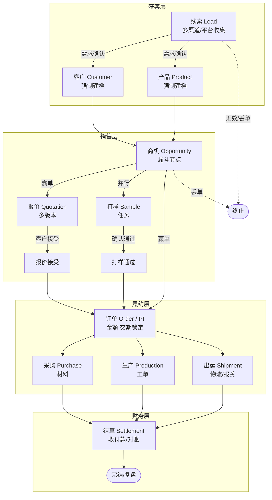
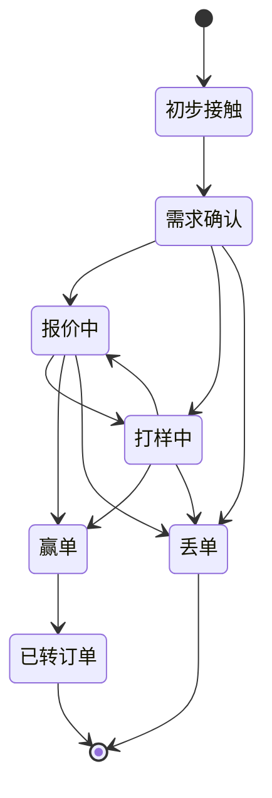
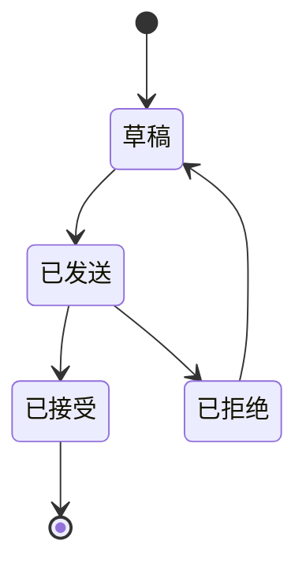
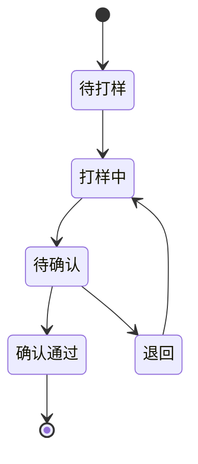
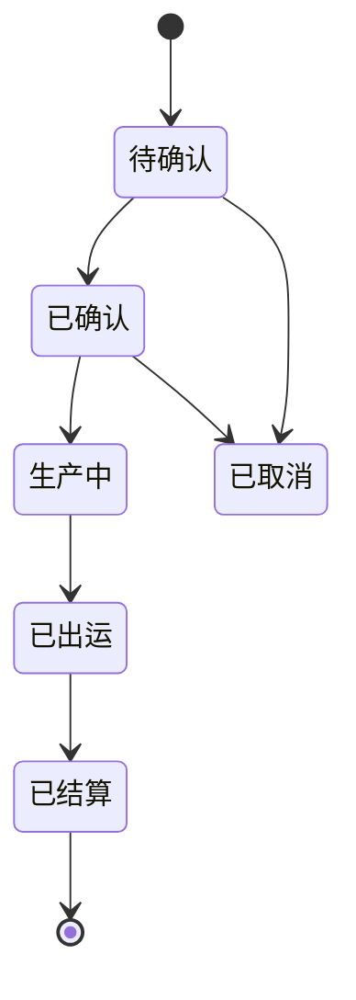
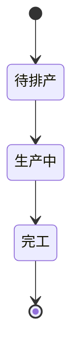
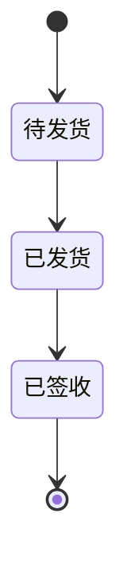
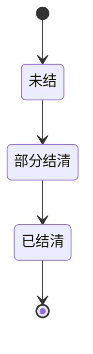

# 业务-生产 工贸一体型企业 全流程管理系统

> 范围：线索 → 客户 → 产品 → 商机 → 报价 → 打样 → 订单 → 采购 → 生产 → 出运 → 结算
> 核心原则：客户/产品是主数据（全局唯一），商机/订单/下游都以"上游 ID"做硬关联，全链路可追溯。

---

## 一、整体业务流程图（端到端）

**关键串联规则（上游 ID 硬关联）：**
- 商机 `.customerId` / `.productId`
- 报价 `.opportunityId`
- 打样 `.opportunityId` + `.productId`
- 订单 `.opportunityId`（赢单后由商机生成）
- 采购 / 生产 / 出运 `.orderId`
- 结算 `.orderId` 或 `.shipmentId`

---

## 二、主对象生命周期状态机

### 2.1 商机 Opportunity

### 2.2 报价 Quotation

### 2.3 打样 Sample

### 2.4 订单 Order / PI

### 2.5 生产 Production

### 2.6 出运 Shipment

### 2.7 结算 Settlement

---

## 三、分层与对象清单

| 层 | 对象 | 说明 | 当前进度 |
|----|------|------|----------|
| 获客层 | 线索 Lead | 渠道来源、需求原始记录 | ✅ 已实现 |
| 主数据 | 客户 Customer | 往来方主数据 | ✅ 已实现 |
| 主数据 | 产品 Product | 货品库（工艺/受众/分类） | ✅ 已实现 |
| 销售层 | 商机 Opportunity | 销售漏斗节点 | ⚠️ 已有壳，待做实 |
| 销售层 | 报价 Quotation | 多版本报价单 | ⬜ 待建 |
| 销售层 | 打样 Sample | 打样任务 | ⬜ 待建 |
| 履约层 | 订单 Order | 履约起点 | ⬜ 待建 |
| 履约层 | 采购 Purchase | 材料采购 | ⬜ 待建 |
| 履约层 | 生产 Production | 工单/进度 | ⬜ 待建 |
| 履约层 | 出运 Shipment | 物流/报关 | ⬜ 待建 |
| 财务层 | 结算 Settlement | 收付款/对账 | ⬜ 待建 |

---

## 四、建议落地顺序（避免一次性全做）

1. **商机做实**：补全金额/阶段/赢单概率，关联报价与打样入口
2. **报价模块**：表单 + 列表，挂 `opportunityId`，支持多版本
3. **打样模块**：任务卡片，挂 `opportunityId` + `productId`
4. **订单模块**：由"赢单商机"一键生成，锁定金额/交期
5. **采购 / 生产 / 出运 / 结算**：以订单为驱动源，逐层扩展

> 每一层复用已有 Customer / Product / Opportunity 主数据，不新建客户/产品表。
