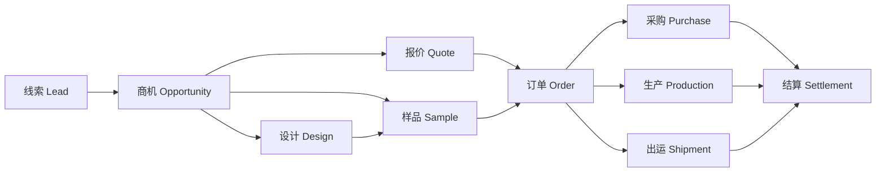
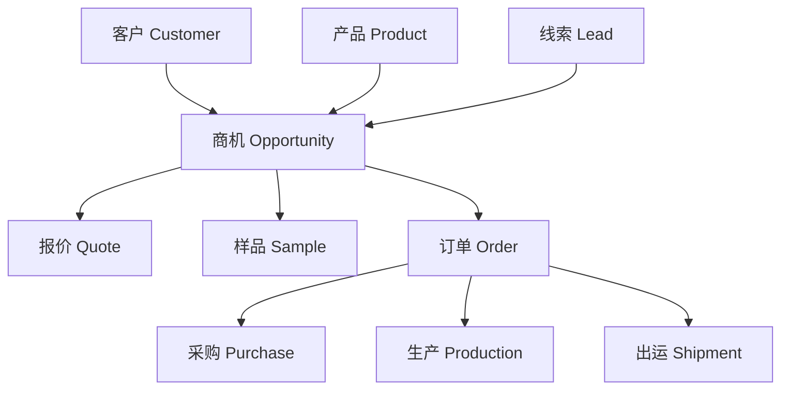
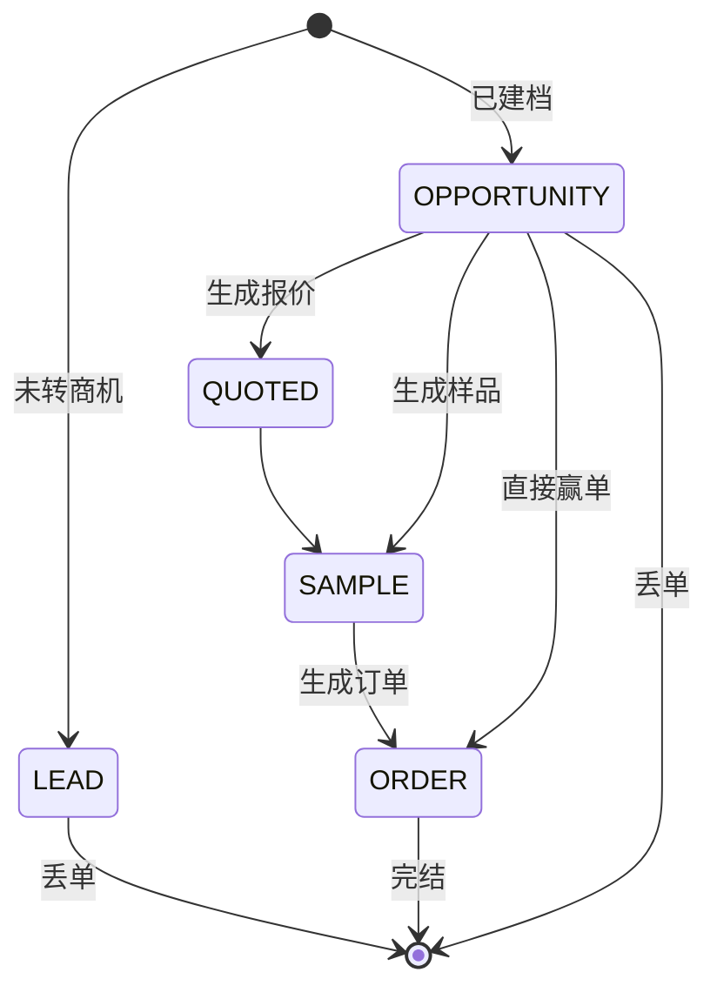
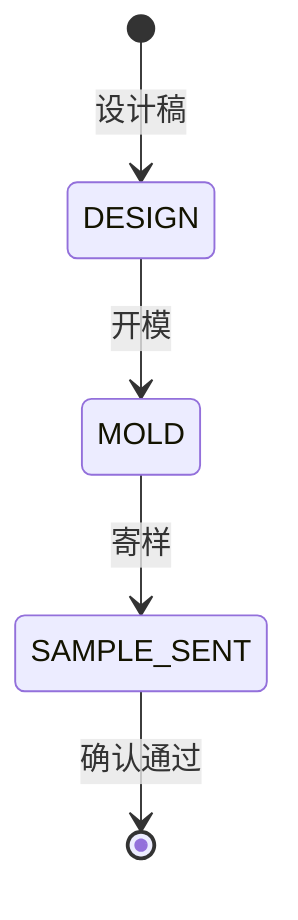
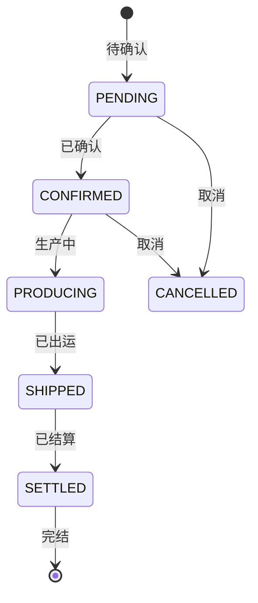
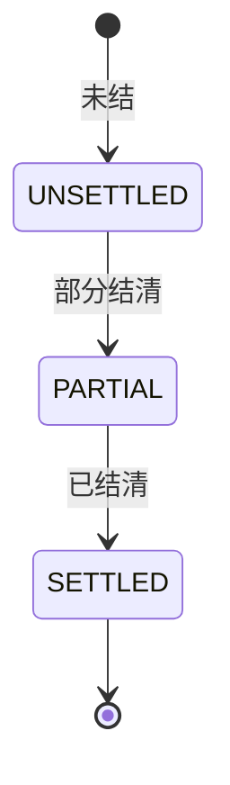

# 业务-生产 工贸一体型企业 全流程管理系统

> 范围：线索 → 客户 → 产品 → 商机 → 报价 → 设计 → 样品 → 订单 → 采购 → 生产 → 出运 → 结算
> 核心原则：客户/产品是主数据（全局唯一），商机/订单/下游都以"上游 ID"做硬关联，全链路可追溯。
> 最后更新：2026-08-28

---

## 一、整体业务流程

### 1.1 主线流程

### 1.2 主数据关系

### 1.3 关键串联规则

| 下游对象 | 必须关联的上游 ID |
|----------|------------------|
| 商机 | `leadId` / `customerId` / `productId` |
| 报价 | `opportunityId` |
| 样品 | `opportunityId` + `productId` |
| 订单 | `opportunityId` |
| 采购 / 生产 / 出运 | `orderId` |
| 结算 | `orderId` 或 `shipmentId` |

---

## 二、状态机

### 2.1 商机阶段（派生，只读）

商机阶段**不落库**，由关联的报价 / 样品 / 订单自动推导，优先级取最高阶段。

| 阶段 | 含义 | 触发条件 |
|------|------|----------|
| `LEAD` | 仅线索 | 尚未转为商机 |
| `OPPORTUNITY` | 已建档 | 已关联线索 / 客户 / 产品 |
| `QUOTED` | 已报价 | 关联 ≥1 报价单 |
| `SAMPLE` | 已打样 | 关联 ≥1 样品单 |
| `ORDER` | 已下单 | 关联 ≥1 正式订单 |

> 同一商机同时存在报价 + 样品 + 订单时，展示最高阶段 `ORDER`。

### 2.2 样品阶段

### 2.3 订单阶段

### 2.4 结算阶段

---

## 三、分层与实现进度

| 层 | 对象 | 当前状态 |
|----|------|----------|
| 获客层 | 线索 Lead | ✅ 已实现 |
| 主数据 | 客户 Customer | ✅ 已实现 |
| 主数据 | 产品 Product | ✅ 已实现 |
| 销售层 | 商机 Opportunity | 🟡 进行中 |
| 销售层 | 报价 Quotation | ⬜ 占位页 |
| 销售层 | 设计 Design | ⬜ 占位页 |
| 销售层 | 样品 Sample | ⬜ 占位页 |
| 履约层 | 订单 Order / PI | ⬜ 占位页 |
| 履约层 | 采购 Purchase | ⬜ 占位页 |
| 履约层 | 生产 Production | ⬜ 占位页 |
| 履约层 | 出运 Shipment | ⬜ 占位页 |
| 财务层 | 结算 Settlement | ⬜ 占位页 |

> 图例：✅ 已实现 / 🟡 进行中 / ⬜ 占位页

---

## 四、建议落地顺序

1. 商机（当前进行中）：完成阶段派生逻辑、列表、详情、编辑。
2. 报价：报价单表单 + 版本管理，挂 `opportunityId`。
3. 样品：打样任务，挂 `opportunityId` + `productId`，阶段 设计 → 开模 → 寄样。
4. 设计：设计稿/版本管理（可放到样品之前或并行）。
5. 订单：由商机赢单生成订单。
6. 采购、生产、出运、结算：以订单为驱动源逐步扩展。

---

## 五、已落地细节

### 5.1 线索 / 客户 / 产品

- 线索：多渠道来源、需求记录、转客户/转产品。
- 客户：往来方主数据，可被商机引用。
- 产品：货品库、工艺/受众/分类，可被商机引用。

### 5.2 商机（进行中）

- 阶段由下游单据自动推导（`server/src/utils/pipelineStage.ts`）。
- 阶段字段已删除数据库 `pipelineStage`，不再支持手动修改。
- 当前复用通用 `Sales` 组件展示，待完成独立的商机详情与编辑。
